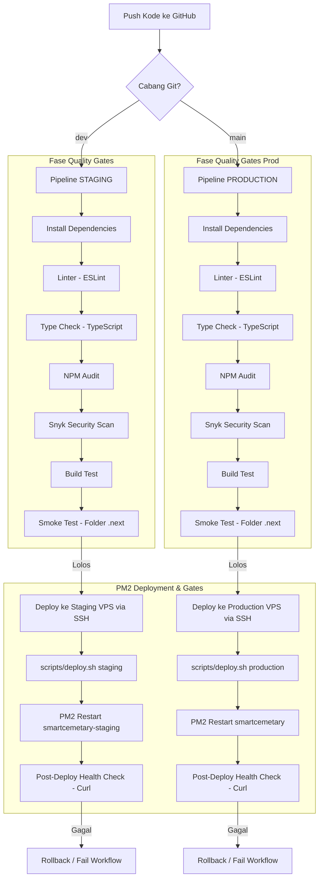

# Smart Cemetery

Sistem Manajemen Pemakaman Digital berbasis Web dengan fitur pendaftaran online, verifikasi admin, dan chatbot AI.

## Fitur Utama

- **Pendaftaran Online**: Pengguna dapat mendaftarkan makam secara mandiri dengan/upload dokumen.
- **Dashboard Admin**: Verifikasi dokumen dan alokasi lokasi makam oleh tim admin.
- **Status Tracking**: Pengguna dapat melihat status pengajuan (Menunggu/Disetujui/Revisi/Ditolak).
- **AI Chatbot**: Bantuan otomatis mengenai prosedur dan regulasi pemakaman.
- **Keamanan Dokumen**: Penggunaan UUID untuk nama file dan Signed URL untuk akses terbatas.
- **Role-Based Access**: Pembedaan fitur antara User dan Admin.

## Tech Stack

- **Frontend**: Next.js 16 (App Router), React 19, Tailwind CSS v4, Lucide Icons
- **Backend**: Next.js API Routes
- **Database**: PostgreSQL (via Supabase)
- **Auth**: Supabase Auth with @supabase/ssr
- **Storage**: Supabase Storage

## Prerequisites

- Node.js 18+
- npm or yarn
- Supabase account (for database & auth)

## Cara Menjalankan

### 1. Clone Repository

```bash
git clone <repository-url>
cd web-testing
```

### 2. Install Dependencies

```bash
npm install
```

### 3. Setup Supabase

1. Buat project baru di [Supabase](https://supabase.com)
2. Buat tabel dengan SQL berikut:

```sql
-- Profiles table
CREATE TABLE public.profiles (
  id UUID PRIMARY KEY REFERENCES auth.users(id),
  email TEXT UNIQUE,
  full_name TEXT,
  role TEXT DEFAULT 'USER' CHECK (role IN ('USER', 'ADMIN')),
  created_at TIMESTAMPTZ DEFAULT NOW()
);

-- Pengajuan table
CREATE TABLE public.pengajuan (
  id UUID PRIMARY KEY DEFAULT gen_random_uuid(),
  user_id UUID REFERENCES public.profiles(id),
  status TEXT DEFAULT 'PENDING' CHECK (status IN ('PENDING', 'REVISION', 'APPROVED', 'REJECTED')),
  notes TEXT,
  created_at TIMESTAMPTZ DEFAULT NOW()
);

-- Makam table
CREATE TABLE public.makam (
  id UUID PRIMARY KEY DEFAULT gen_random_uuid(),
  pengajuan_id UUID REFERENCES public.pengajuan(id),
  user_id UUID REFERENCES public.profiles(id),
  nik TEXT,
  deceased_date DATE,
  applicant_name TEXT,
  applicant_phone TEXT,
  relationship TEXT,
  blok TEXT DEFAULT 'TBA',
  nomor TEXT DEFAULT 'TBA',
  status TEXT DEFAULT 'AVAILABLE' CHECK (status IN ('AVAILABLE', 'RESERVED', 'OCCUPIED'))
);

-- Dokumen table
CREATE TABLE public.dokumen (
  id UUID PRIMARY KEY DEFAULT gen_random_uuid(),
  pengajuan_id UUID REFERENCES public.pengajuan(id),
  user_id UUID REFERENCES public.profiles(id),
  type TEXT CHECK (type IN ('KTP', 'KK', 'SURAT_KEMATIAN')),
  file_url TEXT,
  file_key TEXT
);

-- Chat logs table
CREATE TABLE public.chat_logs (
  id UUID PRIMARY KEY DEFAULT gen_random_uuid(),
  user_id UUID REFERENCES public.profiles(id),
  message TEXT,
  response TEXT,
  created_at TIMESTAMPTZ DEFAULT NOW()
);
```

3. Buat storage bucket:

```sql
INSERT INTO storage.buckets (id, name, public, file_size_limit)
VALUES ('documents', 'documents', false, 5242880);
```

### 4. Konfigurasi Environment

Buat file `.env.local`:

```env
# Supabase (wajib - dari Supabase Dashboard)
NEXT_PUBLIC_SUPABASE_URL="https://your-project.supabase.co"
NEXT_PUBLIC_SUPABASE_ANON_KEY="your-anon-key"

# OpenRouter (opsional - untuk AI chatbot)
OPENROUTER_API_KEY="sk-or-your-key"
AI_MODEL="nvidia/nemotron-3-nano-omni-30b-a3b-reasoning:free"

# Opsional
NEXTAUTH_SECRET="random-secret-string"
```

### 5. Jalankan Aplikasi

```bash
npm run dev
```

Buka http://localhost:3000

## Akun Login

Setelah mendaftar melalui halaman register, akun pertama akan menjadi Admin (ubah manual di database jika diperlukan):

```sql
UPDATE public.profiles SET role = 'ADMIN' WHERE email = 'admin@email.com';
```

## Struktur Project

```
src/
├── app/                    # Next.js App Router pages
│   ├── auth/login/        # Login page
│   ├── auth/register/    # Registration page
│   ├── dashboard/       # User dashboard
│   │   └── pengajuan/   # Pengajuan pages
│   └── api/             # API routes
├── components/            # React components
│   └── dashboard/       # Dashboard components
└── lib/                 # Utilities
    ├── supabase/        # Supabase clients
    └── storage.ts       # File upload utilities
```

## Fitur Halaman

| Halaman                         | Akses  | Deskripsi                      |
| ------------------------------- | ------ | ------------------------------ |
| /                               | Public | Home page                      |
| /auth/login                     | Public | Login form                     |
| /auth/register                  | Public | Registration (@gmail.com only) |
| /dashboard                      | User   | Dashboard + pengajuan list     |
| /dashboard/pengajuan/baru       | User   | Submit new pengajuan           |
| /dashboard/pengajuan            | User   | View status                    |
| /dashboard/admin                | Admin  | Admin dashboard                |
| /dashboard/admin/pengajuan/[id] | Admin  | Review & update status         |

## AI Chatbot (RAG)

Sistem memiliki dua implementasi AI chatbot:

### 1. Web Chatbot (Integrated)

- **File**: `src/lib/ai-rag.ts`
- **Usage**: Chat page di `/dashboard/chat`
- **Features**: Integrated dengan Next.js, menggunakan OpenRouter API

### 2. Standalone RAG Chatbot (Python)

- **File**: `rag_chatbot.py`
- **Usage**: CLI chatbot berbasis PDF regulations
- **Features**: RAG dengan FAISS, multilingual embeddings, PDF parsing

#### Setup

```bash
pip install -r requirements.txt
python rag_chatbot.py
```

#### Requirements

- Python 3.8+
- PDF regulations di parent directory (`../*.pdf`)
- OpenRouter API key (sudah ada di `.env`)

## Keamanan & DevSecOps Workflow

Sistem ini menerapkan workflow DevSecOps modern tingkat enterprise dengan pertahanan berlapis (Defense-in-Depth), pipeline validasi otomatis, dan integrasi multi-environment.

### 1. Arsitektur CI/CD

Pipeline CI/CD didesain menggunakan GitHub Actions untuk menjamin setiap kode yang masuk ke server telah lolos seluruh *quality gates* keamanan dan fungsionalitas.



### 2. Strategi Percabangan (Branching Strategy)

| Cabang | Lingkungan (Environment) | PM2 Process Name | Port Default | URL Akses | Pemicu (Trigger) |
| :--- | :--- | :--- | :--- | :--- | :--- |
| `dev` | **Staging** | `smartcemetary-staging` | `3001` | `https://staging.smartcemetary.web.id` | Push / Merge ke `dev` |
| `main` | **Production** | `smartcemetary` | `3000` | `https://smartcemetary.web.id` | Push / Merge ke `main` |

- **Feature Branches (`feature/*`)**: Digunakan oleh developer untuk mengembangkan fitur baru secara lokal. Wajib membuat Pull Request (PR) ke cabang `dev` untuk penggabungan.
- **Staging Branch (`dev`)**: Mengintegrasikan semua fitur baru sebelum rilis. Setiap push ke `dev` memicu otomatisasi pengujian dan penyebaran langsung ke server staging.
- **Production Branch (`main`)**: Cabang utama yang sangat stabil. Penyebaran hanya dilakukan setelah semua validasi di staging lolos tanpa cacat.

### 3. Penjelasan Quality Gates & Validasi Keamanan

Sebelum kode dideploy ke server VPS, pipeline GitHub Actions menjalankan serangkaian pengujian otomatis:
1. **ESLint Quality Gate (`npm run lint`)**: Memastikan kualitas penulisan kode TypeScript/React memenuhi standar industri bebas dari unused imports, unused variables, dan standard code-smells.
2. **TypeScript Compilation Check (`npx tsc --noEmit`)**: Memverifikasi tidak ada kesalahan tipe data (strict type safety) di seluruh aplikasi backend & frontend.
3. **NPM Audit (`npm audit`)**: Melakukan pemindaian terhadap dependensi proyek untuk mendeteksi kerentanan keamanan berkategori High/Critical secara otomatis.
4. **Snyk Security Scan (`snyk/actions/node`)**: Integrasi dengan Snyk SAST (Static Application Security Testing) untuk mendeteksi celah keamanan pada dependensi dan source code pihak ketiga.
5. **Next.js Build Verification (`npm run build`)**: Menjamin proyek dapat dikompilasi secara sukses menjadi aset statis dan server-side yang optimal.
6. **Smoke Testing**: Memverifikasi keberadaan direktori hasil build `.next` sebelum menginisiasi penyebaran remote.

### 4. Skrip Deployment VPS (`scripts/deploy.sh`)

Untuk meminimalkan konfigurasi langsung di GitHub Actions runner, proses rilis di server diatur oleh skrip shell mandiri yang aman (`set -euo pipefail`):
```bash
./scripts/deploy.sh [staging|production]
```
**Alur Kerja Skrip:**
1. Mendeteksi lingkungan target secara otomatis dan mencocokkan cabang Git serta nama proses PM2 yang tepat.
2. Melakukan sinkronisasi kode terbaru (`git pull origin <branch>`).
3. Menginstal dependensi secara bersih (`npm install`).
4. Mengompilasi aplikasi (`npm run build`).
5. Menjalankan *quality gate* lokal untuk memastikan folder `.next` berhasil dibuat.
6. Melakukan hot-restart/graceful restart proses PM2 terkait (`smartcemetary` atau `smartcemetary-staging`).
7. Menyimpan daftar proses PM2 (`pm2 save`) agar tetap aktif saat server di-reboot.

### 5. Post-Deployment Quality Gates (Health Check)

Setelah penyebaran berhasil dilakukan di server VPS, pipeline GitHub Actions akan menjeda eksekusi selama 15 detik untuk membiarkan server Next.js menyala sempurna di bawah kendali PM2.
Selanjutnya, runner akan mengeksekusi pemeriksaan kesehatan menggunakan `curl` secara langsung ke URL publik:
- Jika server merespons dengan status code `200`, `302`, atau `307`, deployment dinyatakan **SUKSES** ✅.
- Jika server tidak merespons atau mengembalikan status code error (seperti `500 Internal Server Error` atau `000` / Unreachable), deployment dinyatakan **GAGAL** ❌ dan workflow GitHub Actions akan langsung dihentikan untuk segera diinvestigasi.

### 6. Kebutuhan GitHub Secrets

Untuk menjalankan alur kerja di GitHub Actions, pastikan variabel rahasia berikut telah didaftarkan pada repository:
- `VPS_HOST`: Alamat IP server VPS Anda.
- `VPS_USERNAME`: Username SSH untuk masuk ke server (misal: `root` atau `ubuntu`).
- `SSH_PRIVATE_KEY`: Kunci privat SSH Anda untuk akses aman tanpa kata sandi.
- `VPS_PORT` (Opsional): Port SSH VPS (default: 22).
- `SNYK_TOKEN`: Token otentikasi Snyk untuk pemindaian kerentanan keamanan dependensi.
- `STAGING_APP_URL` & `PRODUCTION_APP_URL` (Opsional): URL publik untuk verifikasi curl health check.

---

## Keamanan Umum

- Semua Environment Variables diabaikan oleh Git (`.env*`)
- RLS (Row Level Security) diaktifkan pada database Supabase untuk tabel sensitif
- File upload menggunakan UUID acak untuk mencegah ID enumeration
- Akses ke dokumen privat diatur ketat menggunakan Signed URL (kedaluwarsa dalam 15 menit)

## Lisensi

MIT License
