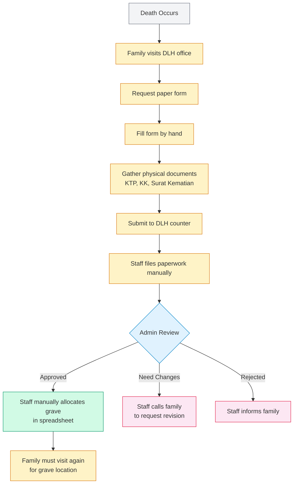
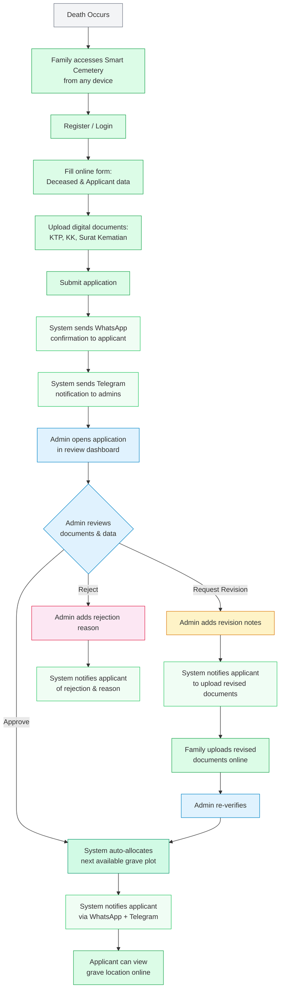
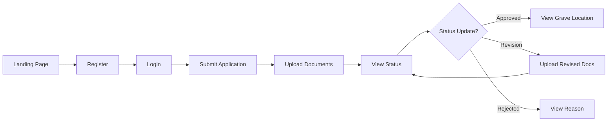
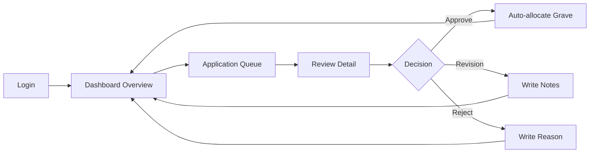

# Business Process Flow

> **As-Is vs. To-Be: How burial registration changes with Smart Cemetery**

---

## 1. As-Is Process (Before Smart Cemetery)

The traditional workflow relies on paper forms, physical visits, and manual coordination.

### Pain Points in the As-Is Process

1. **Multiple physical visits** — Families must visit the DLH office at least twice (submission + result)
2. **Paper documents** — Prone to damage, loss, and disorganization
3. **No status visibility** — Families cannot track progress without calling
4. **Manual grave allocation** — Staff uses spreadsheets, prone to errors and double-booking
5. **Phone-based communication** — Staff must call families for revisions or approvals
6. **No audit trail** — Decisions and changes are not systematically recorded
7. **Manual reporting** — Statistics require manual compilation from paper records

---

## 2. To-Be Process (With Smart Cemetery)

The digital workflow eliminates physical visits and automates coordination.

### Key Improvements in the To-Be Process

| Step | Before | After |
|------|--------|-------|
| **Form submission** | In-person at DLH office | Online from any device, 24/7 |
| **Document delivery** | Physical photocopies | Digital upload (PDF/images) |
| **Application confirmation** | None / verbal | Automatic WhatsApp message |
| **Status checking** | Phone call or visit | Real-time online dashboard |
| **Document review** | Paper files shuffled between desks | Side-by-side document preview in browser |
| **Grave allocation** | Manual spreadsheet lookup | Auto-assigned from available plots |
| **Status notifications** | Manual phone calls | Automated WhatsApp + Telegram |
| **Revisions** | Visit office to resubmit | Upload revised documents online |
| **Reporting** | Manual data compilation | Real-time dashboard + export |

---

## 3. User Journey Summary

### Applicant Journey

### Admin Journey

---

*Next: [03 — Functional Requirements](./03-functional-requirements.md) — Complete feature list.*
