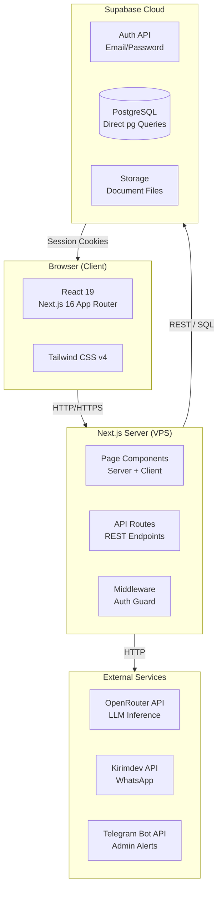
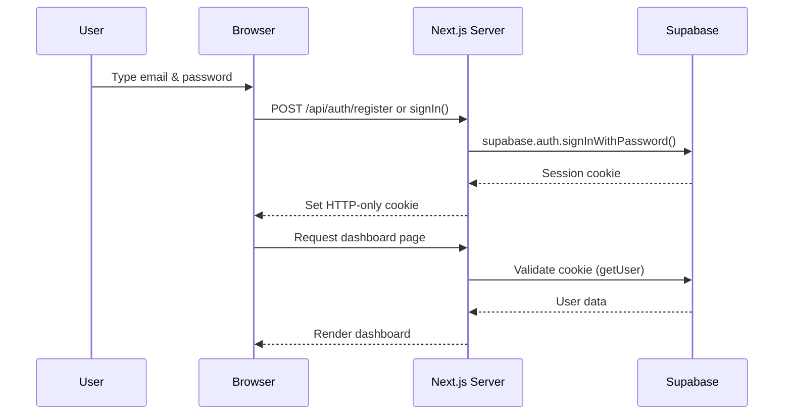
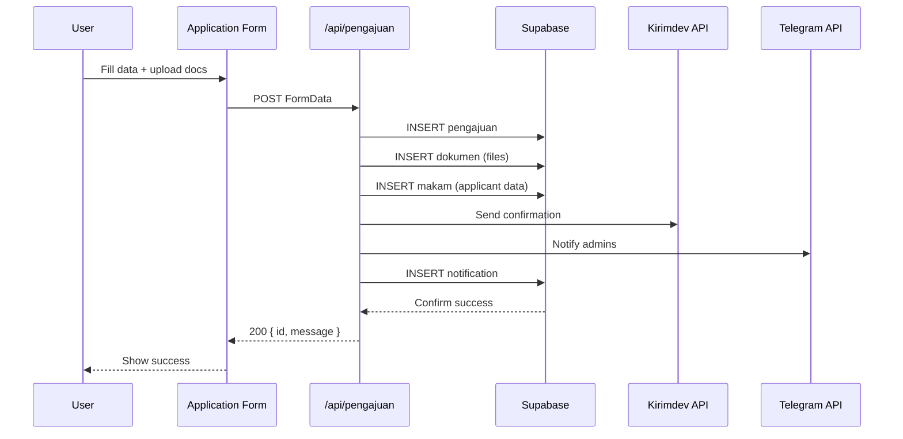

# System Architecture & Technology Stack

> **How the application is built — frameworks, services, and connections**

---

## 1. Architecture Overview



---

## 2. Technology Stack

### Core Framework

| Technology | Version | Purpose |
|------------|---------|---------|
| **Next.js** | 16.2.2 | Full-stack React framework (App Router, API Routes, SSR) |
| **React** | 19.2.4 | UI component library |
| **TypeScript** | ^5 | Type-safe JavaScript |
| **Node.js** | 22+ (production) / 20+ (development) | JavaScript runtime |

### Frontend

| Technology | Version | Purpose |
|------------|---------|---------|
| **Tailwind CSS** | v4 | Utility-first CSS framework (via PostCSS) |
| **@tailwindcss/postcss** | ^4 | Tailwind PostCSS plugin |
| **Lucide React** | ^1.7.0 | Icon component library |
| **React Markdown** | ^10.1.0 | Markdown rendering for AI chatbot |
| **remark-gfm** | ^4.0.1 | GitHub Flavored Markdown support |
| **Leaflet** | ^1.9.4 | Interactive maps |
| **react-leaflet** | ^5.0.0 | React wrapper for Leaflet |
| **Recharts** | ^3.8.1 | Charting library for admin reports |
| **@fontsource/inter** | ^5.2.8 | Inter font (body text) |
| **@fontsource/manrope** | ^5.2.8 | Manrope font (headings) |

### Backend & Database

| Technology | Version | Purpose |
|------------|---------|---------|
| **Supabase JS** | ^2.102.1 | Supabase client SDK |
| **Supabase SSR** | ^0.10.2 | Server-side rendering auth helpers |
| **pg** (node-postgres) | ^8.20.0 | Direct PostgreSQL connection pool |
| **NextAuth** | ^4.24.13 | Additional auth layer (Credentials Provider) |
| **bcrypt** | ^6.0.0 | Password hashing |
| **UUID** | ^13.0.0 | Cryptographically random UUID generation |
| **jsPDF** | ^4.2.1 | PDF report generation |
| **jspdf-autotable** | ^5.0.8 | PDF table plugin |
| **xlsx** | ^0.18.5 | Excel report generation |

### Infrastructure

| Component | Purpose |
|-----------|---------|
| **Supabase PostgreSQL** | Primary database (managed) |
| **Supabase Auth** | Email/password authentication with JWT |
| **Supabase Storage** | Private document storage bucket |
| **PM2** | Node.js process manager on VPS |
| **GitHub Actions** | CI/CD pipeline automation |
| **VPS (Ubuntu)** | Production and staging servers |

---

## 3. Architecture Patterns

### Rendering Strategy

| Pattern | Where Used |
|---------|------------|
| **Server Components** | Landing page (`/`), public routes |
| **Client Components** | All dashboard pages, forms, interactive UI |
| **API Routes** | All backend endpoints under `/api/*` |
| **Middleware** | Route-level auth guard (`middleware.ts`) |

### Authentication Flow



### Data Flow — Application Submission



---

## 4. Project Structure

```
src/
├── app/                     # Next.js App Router
│   ├── api/                 # REST API routes
│   │   ├── admin/           # Admin endpoints
│   │   ├── auth/            # Auth endpoints
│   │   ├── cemeteries/      # Cemetery data endpoints
│   │   ├── chat/            # Chatbot endpoints
│   │   ├── notifications/   # SSE notification stream
│   │   └── pengajuan/       # Application endpoints
│   ├── auth/                # Login, register, reset password pages
│   ├── dashboard/           # Protected dashboard pages
│   │   ├── admin/           # Admin-only pages
│   │   ├── pengajuan/       # Application user pages
│   │   ├── chat/            # Full chat interface
│   │   └── pengaturan/      # Account settings
│   ├── makam/               # Public cemetery map
│   ├── layout.tsx           # Root layout
│   └── globals.css          # Global styles + Tailwind
├── components/
│   ├── admin/               # Admin-specific components
│   │   └── pengajuan-detail/ # Detail view components
│   ├── dashboard/           # Dashboard components
│   ├── header.tsx           # Main navigation header
│   ├── dashboard-header.tsx # Dashboard-specific header
│   ├── footer.tsx           # Site footer
│   ├── chat-widget.tsx      # Floating AI chatbot
│   └── providers.tsx        # Supabase context provider
├── lib/
│   ├── auth.ts              # NextAuth config
│   ├── auth-service.ts      # Supabase Auth wrapper
│   ├── supabase-auth.ts     # Server-side Supabase client
│   ├── supabase.ts          # Public Supabase client
│   ├── db.ts                # pg connection pool
│   ├── init-db.ts           # Database schema initialization
│   ├── storage.ts           # Supabase Storage operations
│   ├── kirimdev.ts          # Kirimdev WhatsApp API
│   ├── whatsapp.ts          # WhatsApp notification builder
│   ├── telegram.ts          # Telegram bot integration
│   ├── ai-rag.ts            # AI chatbot with RAG
│   └── reference-number.ts  # EKM-XXXX-XXXX generator
└── middleware.ts             # Route-level auth guard
```

---

## 5. Security Architecture

| Layer | Mechanism |
|-------|-----------|
| **Authentication** | Supabase Auth (email/password) + NextAuth JWT |
| **Authorization** | Middleware role check (ADMIN/USER) + API-level verification |
| **Session** | HTTP-only cookies via @supabase/ssr with auto-refresh |
| **File Access** | UUID filenames (prevent enumeration) + Signed URLs (1-hour expiry) |
| **Database** | Row-Level Security (RLS) policies on Supabase tables |
| **API** | Server-side auth validation on all protected endpoints |
| **CI/CD** | Secrets via GitHub Secrets, never hardcoded |

---

*Next: [02 — Environment Setup](./02-environment-setup.md) — How to set up and run the application.*
