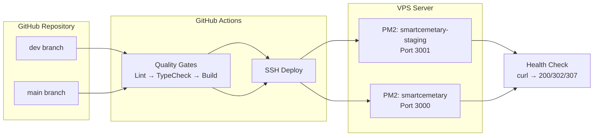

# Environment Setup & Configuration

> **Hardware requirements, environment variables, and deployment guide**

---

## 1. Minimum Hardware Requirements

### Development Machine

| Resource | Minimum | Recommended |
|----------|---------|-------------|
| **CPU** | 2 cores | 4+ cores |
| **RAM** | 4 GB | 8+ GB |
| **Storage** | 1 GB free | 5 GB free (SSD) |
| **OS** | macOS, Linux, or Windows (WSL2) | macOS / Linux |
| **Node.js** | 20.x | 22.x |
| **npm** | 9.x | 10.x |

### Production Server (VPS)

| Resource | Minimum | Recommended |
|----------|---------|-------------|
| **CPU** | 1 core | 2+ cores |
| **RAM** | 1 GB | 2+ GB |
| **Storage** | 5 GB | 10+ GB (SSD) |
| **OS** | Ubuntu 22.04 | Ubuntu 24.04 |
| **Node.js** | 22.x | 22.x LTS |
| **PM2** | 5.x | 5.x |

---

## 2. Environment Variables

Create a `.env.local` file in the project root with the following configuration:

```env
# ── Supabase (Required) ───────────────────────────────────────
# Get these from your Supabase project dashboard → Settings → API
NEXT_PUBLIC_SUPABASE_URL="https://your-project.supabase.co"
NEXT_PUBLIC_SUPABASE_ANON_KEY="your-anon-key"
SUPABASE_SERVICE_ROLE_KEY="your-service-role-key"
DATABASE_URL="postgresql://postgres:[password]@[host]:[port]/postgres"

# ── NextAuth (Optional — auto-generated if omitted) ───────────
NEXTAUTH_SECRET="any-random-secret-string-32-characters"
NEXTAUTH_URL="https://your-domain.com/"

# ── AI Chatbot (Optional — chatbot uses fallback if absent) ───
OPENROUTER_API_KEY="sk-or-v1-your-key"
AI_MODEL="nvidia/nemotron-nano-9b-v2:free"
AI_FALLBACK_MODEL="nvidia/nemotron-3-nano-30b-a3b:free"
AI_TIMEOUT_MS=50000

# ── Telegram Notifications (Optional) ─────────────────────────
TELEGRAM_BOT_TOKEN="your-telegram-bot-token"
ADMIN_TELEGRAM_IDS="123456789,987654321"

# ── WhatsApp (Kirimdev) Notifications (Optional) ──────────────
KIRIMDEV_API_KEY="kdv_live_your-key"
KIRIMDEV_PHONE_NUMBER_ID="your-phone-number-id"
ADMIN_WHATSAPP_NUMBER="6281234567890"
```

### Variable Reference

| Variable | Required | Purpose |
|----------|----------|---------|
| `NEXT_PUBLIC_SUPABASE_URL` | ✅ Yes | Supabase project API URL |
| `NEXT_PUBLIC_SUPABASE_ANON_KEY` | ✅ Yes | Public anon key for client-side access |
| `SUPABASE_SERVICE_ROLE_KEY` | ✅ Yes | Admin key for server-side operations (bypasses RLS) |
| `DATABASE_URL` | ✅ Yes | PostgreSQL connection string for direct pg queries |
| `NEXTAUTH_SECRET` | ⬜ No | NextAuth JWT encryption key (auto-generated if missing) |
| `NEXTAUTH_URL` | ⬜ No | Application canonical URL |
| `OPENROUTER_API_KEY` | ⬜ No | OpenRouter API key for AI chatbot |
| `AI_MODEL` | ⬜ No | Primary LLM model identifier |
| `AI_FALLBACK_MODEL` | ⬜ No | Fallback LLM model identifier |
| `AI_TIMEOUT_MS` | ⬜ No | LLM request timeout in milliseconds |
| `TELEGRAM_BOT_TOKEN` | ⬜ No | Telegram bot token for admin notifications |
| `ADMIN_TELEGRAM_IDS` | ⬜ No | Comma-separated admin Telegram chat IDs |
| `KIRIMDEV_API_KEY` | ⬜ No | Kirimdev API key for WhatsApp messages |
| `KIRIMDEV_PHONE_NUMBER_ID` | ⬜ No | Kirimdev phone number ID (Meta WhatsApp) |
| `ADMIN_WHATSAPP_NUMBER` | ⬜ No | Admin WhatsApp number for notifications |

---

## 3. Local Development Setup

### Prerequisites

- Node.js 20+ installed
- A Supabase account (free tier works)
- Git

### Step-by-Step

```bash
# 1. Clone the repository
git clone <repository-url>
cd web-testing

# 2. Install dependencies
npm install

# 3. Set up environment variables
cp .env.example .env.local
# Then edit .env.local with your Supabase credentials

# 4. Start the development server
npm run dev

# 5. Open in browser
open http://localhost:3000
```

### Database Schema Setup

The application requires specific tables in Supabase PostgreSQL. Apply these via the Supabase SQL Editor or run:

```bash
npx tsx src/lib/init-db.ts
```

Alternatively, apply the migration files manually from `supabase/migrations/`:

1. `001_add_chat_sessions_and_messages.sql`
2. `002_cemetery_normalization.sql`

### Required Supabase Tables (profiles)

The `profiles` table links to Supabase Auth users. Create it manually:

```sql
CREATE TABLE IF NOT EXISTS profiles (
  id UUID PRIMARY KEY REFERENCES auth.users(id) ON DELETE CASCADE,
  email TEXT,
  full_name TEXT,
  phone TEXT,
  role TEXT DEFAULT 'USER' CHECK (role IN ('USER', 'ADMIN')),
  telegram_chat_id TEXT,
  created_at TIMESTAMPTZ DEFAULT NOW(),
  updated_at TIMESTAMPTZ DEFAULT NOW()
);
```

### Storage Bucket Setup

Create a private storage bucket named `documents` (5 MB file size limit):

```sql
INSERT INTO storage.buckets (id, name, public, file_size_limit)
VALUES ('documents', 'documents', false, 5242880);
```

---

## 4. Production Deployment

### Environment Architecture



### CI/CD Pipeline

The `.github/workflows/deploy.yml` workflow runs on every push to `dev` or `main`:

| Stage | Command | Purpose |
|-------|---------|---------|
| **Install** | `npm install` | Install dependencies |
| **Lint** | `npm run lint` | Code quality check |
| **Type Check** | `npx tsc --noEmit` | TypeScript verification |
| **Build** | `npm run build` | Production build |
| **Smoke Test** | `test -d .next` | Verify build output |
| **Deploy** | SSH to VPS | Pull → Install → Build → PM2 restart |

### Manual Deployment

```bash
# Deploy to staging (dev branch)
./scripts/deploy.sh staging

# Deploy to production (main branch)
./scripts/deploy.sh production
```

The `scripts/deploy.sh` script automates:
1. Git fetch & checkout the target branch
2. `npm install` dependencies
3. `npm run build` the application
4. Verify `.next` directory exists
5. PM2 restart (or start) the application
6. `pm2 save` for reboot persistence

### PM2 Process Management

```bash
# List running processes
pm2 list

# View application logs
pm2 logs smartcemetary

# Monitor resource usage
pm2 monit

# Restart application
pm2 restart smartcemetary

# Stop application
pm2 stop smartcemetary
```

### Post-Deployment Health Check

The CI/CD pipeline waits 15 seconds for warm-up, then checks:

```bash
curl -s -o /dev/null -w "%{http_code}" https://smartcemetary.web.id
```

Expected: `200`, `302`, or `307`.

---

## 5. Available Commands

```bash
npm run dev       # Start development server (port 3000)
npm run build     # Production build
npm run start     # Start production server
npm run lint      # Run ESLint
```

---

## 6. Supabase Connection Details

- **Project URL:** `https://lzkujbjnculnffpsnjke.supabase.co`
- **Database Host:** `aws-1-ap-northeast-1.pooler.supabase.com`
- **Database Port:** `5432`
- **Storage Bucket:** `documents` (private)

---

*Next: [03 — Data Structure & API](./03-data-structure-api.md) — Database schema and endpoint specifications.*
