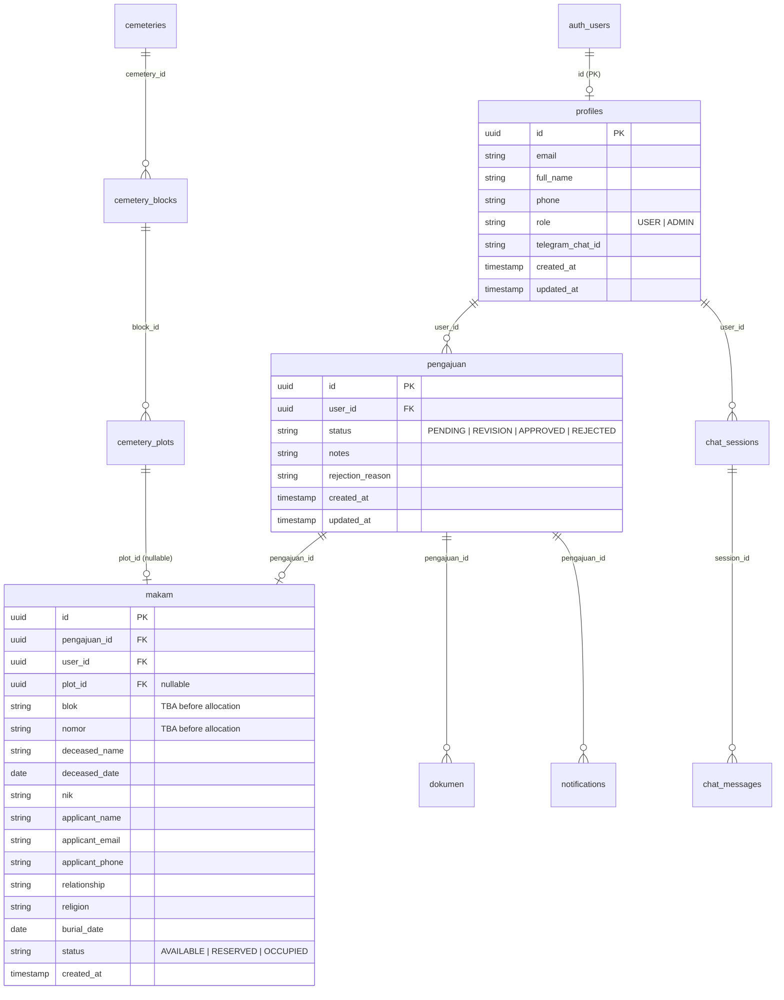

# Data Structure & API Specification

> **Database schema, entity relationships, and API endpoint reference**

---

## 1. Entity Relationship Diagram



---

## 2. Table Definitions

### `profiles`

Links Supabase Auth users to application data.

| Column | Type | Constraints | Description |
|--------|------|-------------|-------------|
| `id` | UUID | PK, FK → `auth.users.id` | User ID from Supabase Auth |
| `email` | TEXT | | User email address |
| `full_name` | TEXT | | User display name |
| `phone` | TEXT | | User phone number |
| `role` | TEXT | `CHECK ('USER', 'ADMIN')`, Default: `'USER'` | User role for RBAC |
| `telegram_chat_id` | TEXT | | Telegram chat ID for notifications |
| `created_at` | TIMESTAMPTZ | Default: `NOW()` | Record creation timestamp |
| `updated_at` | TIMESTAMPTZ | Default: `NOW()` | Record update timestamp |

### `pengajuan`

Burial applications submitted by users.

| Column | Type | Constraints | Description |
|--------|------|-------------|-------------|
| `id` | UUID | PK, Default: `gen_random_uuid()` | Application ID |
| `user_id` | UUID | FK → `profiles.id` | User who submitted |
| `status` | TEXT | `CHECK ('PENDING', 'REVISION', 'APPROVED', 'REJECTED')`, Default: `'PENDING'` | Current application status |
| `notes` | TEXT | | Admin notes |
| `rejection_reason` | TEXT | | Reason for rejection |
| `created_at` | TIMESTAMPTZ | Default: `NOW()` | Submission timestamp |
| `updated_at` | TIMESTAMPTZ | Default: `NOW()` | Last update timestamp |

### `makam`

Grave registration data linked to each application.

| Column | Type | Constraints | Description |
|--------|------|-------------|-------------|
| `id` | UUID | PK, Default: `gen_random_uuid()` | Record ID |
| `pengajuan_id` | UUID | FK → `pengajuan.id` ON DELETE SET NULL | Associated application |
| `user_id` | UUID | FK → `profiles.id` ON DELETE SET NULL | User who submitted |
| `plot_id` | UUID | FK → `cemetery_plots.id` ON DELETE SET NULL | Allocated plot (nullable) |
| `blok` | TEXT | Default: `'TBA'` | Grave block code |
| `nomor` | TEXT | Default: `'TBA'` | Grave plot number |
| `deceased_name` | TEXT | | Name of the deceased |
| `deceased_date` | DATE | | Date of death |
| `nik` | TEXT | | NIK of deceased |
| `applicant_name` | TEXT | | Name of applicant |
| `applicant_email` | TEXT | | Applicant email |
| `applicant_phone` | TEXT | | Applicant phone number |
| `relationship` | TEXT | | Relationship to deceased |
| `religion` | TEXT | | Religion |
| `burial_date` | DATE | | Preferred burial date |
| `status` | TEXT | `CHECK ('AVAILABLE', 'RESERVED', 'OCCUPIED')`, Default: `'AVAILABLE'` | Grave status |
| `created_at` | TIMESTAMPTZ | Default: `NOW()` | Record creation timestamp |

### `dokumen`

Uploaded documents for each application.

| Column | Type | Constraints | Description |
|--------|------|-------------|-------------|
| `id` | UUID | PK, Default: `gen_random_uuid()` | Document ID |
| `pengajuan_id` | UUID | FK → `pengajuan.id` ON DELETE CASCADE | Associated application |
| `user_id` | UUID | FK → `profiles.id` | User who uploaded |
| `type` | TEXT | `CHECK ('KTP', 'KK', 'SURAT_KEMATIAN', 'SURAT_RT_RW')` | Document type |
| `file_url` | TEXT | | Public URL or storage path |
| `file_key` | TEXT | | Storage key for signed URL generation |
| `created_at` | TIMESTAMPTZ | Default: `NOW()` | Upload timestamp |

### `cemeteries`

Managed cemetery locations.

| Column | Type | Constraints | Description |
|--------|------|-------------|-------------|
| `id` | UUID | PK, Default: `gen_random_uuid()` | Cemetery ID |
| `name` | TEXT | NOT NULL | Cemetery name |
| `code` | TEXT | NOT NULL, UNIQUE | Short code identifier |
| `address` | TEXT | | Physical address |
| `description` | TEXT | | Description |
| `map_config` | JSONB | Default: `'{}'` | Map configuration (viewBox, colors) |
| `created_at` | TIMESTAMPTZ | Default: `NOW()` | Record creation timestamp |

### `cemetery_blocks`

Blocks/sections within each cemetery.

| Column | Type | Constraints | Description |
|--------|------|-------------|-------------|
| `id` | UUID | PK, Default: `gen_random_uuid()` | Block ID |
| `cemetery_id` | UUID | FK → `cemeteries.id` ON DELETE CASCADE | Parent cemetery |
| `name` | TEXT | NOT NULL | Block name (e.g., "Blok A") |
| `code` | TEXT | NOT NULL | Block code (e.g., "A") |
| `capacity` | INTEGER | NOT NULL, Default: `0` | Number of plots |
| `map_coords` | JSONB | Default: `'{}'` | SVG coordinates for map rendering |
| `polygon` | JSONB | Default: `'{}'` | Polygon geometry for interactive maps |
| `sort_order` | INTEGER | Default: `0` | Priority order for auto-allocation |
| `created_at` | TIMESTAMPTZ | Default: `NOW()` | Record creation timestamp |
| | | UNIQUE(cemetery_id, code) | Unique block code per cemetery |

### `cemetery_plots`

Individual grave plots within each block.

| Column | Type | Constraints | Description |
|--------|------|-------------|-------------|
| `id` | UUID | PK, Default: `gen_random_uuid()` | Plot ID |
| `block_id` | UUID | FK → `cemetery_blocks.id` ON DELETE CASCADE | Parent block |
| `plot_number` | TEXT | NOT NULL | Plot number (e.g., "1", "2") |
| `status` | TEXT | NOT NULL, `CHECK ('AVAILABLE', 'RESERVED', 'OCCUPIED')`, Default: `'AVAILABLE'` | Plot availability |
| `map_coords` | JSONB | Default: `'{}'` | SVG coordinates |
| `created_at` | TIMESTAMPTZ | Default: `NOW()` | Record creation timestamp |
| | | UNIQUE(block_id, plot_number) | Unique plot number per block |

### `notifications`

In-app notification records.

| Column | Type | Constraints | Description |
|--------|------|-------------|-------------|
| `id` | UUID | PK, Default: `gen_random_uuid()` | Notification ID |
| `type` | TEXT | NOT NULL, `CHECK ('pengajuan', 'revision', 'approved', 'rejected', 'system')` | Notification type |
| `title` | TEXT | NOT NULL | Notification title |
| `message` | TEXT | NOT NULL | Notification body |
| `read` | BOOLEAN | Default: `FALSE` | Read status |
| `user_id` | UUID | FK → `profiles.id` ON DELETE SET NULL | Target user |
| `pengajuan_id` | UUID | FK → `pengajuan.id` ON DELETE SET NULL | Related application |
| `created_at` | TIMESTAMPTZ | Default: `NOW()` | Creation timestamp |

### `chat_sessions`

AI chatbot conversation sessions.

| Column | Type | Constraints | Description |
|--------|------|-------------|-------------|
| `id` | UUID | PK, Default: `gen_random_uuid()` | Session ID |
| `user_id` | UUID | FK → `profiles.id` ON DELETE SET NULL | User (nullable for anonymous) |
| `ip_hash` | TEXT | | Hashed IP for anonymous tracking |
| `title` | TEXT | | Auto-generated session title |
| `last_message` | TEXT | | Preview of last message |
| `created_at` | TIMESTAMPTZ | Default: `NOW()` | Creation timestamp |
| `updated_at` | TIMESTAMPTZ | Default: `NOW()` | Last activity timestamp |

### `chat_messages`

Individual messages within a chat session.

| Column | Type | Constraints | Description |
|--------|------|-------------|-------------|
| `id` | UUID | PK, Default: `gen_random_uuid()` | Message ID |
| `session_id` | UUID | FK → `chat_sessions.id` ON DELETE CASCADE | Parent session |
| `role` | TEXT | NOT NULL, `CHECK ('user', 'ai')` | Message sender |
| `content` | TEXT | NOT NULL | Message content |
| `created_at` | TIMESTAMPTZ | Default: `NOW()` | Timestamp |

---

## 3. API Endpoint Reference

### Authentication

| Method | Endpoint | Auth | Description |
|--------|----------|------|-------------|
| `POST` | `/api/auth/register` | Public | Register new user |
| `POST` | `/api/auth/logout` | Required | Logout user |
| `POST` | `/api/auth/create-admin` | Required | Create admin account |

### Applications

| Method | Endpoint | Auth | Description |
|--------|----------|------|-------------|
| `POST` | `/api/pengajuan` | Required | Submit new application (multipart) |
| `GET` | `/api/pengajuan` | Required | Get user's applications |
| `POST` | `/api/pengajuan/revision` | Required | Submit revised documents |

### Admin — Applications

| Method | Endpoint | Auth | Description |
|--------|----------|------|-------------|
| `PATCH` | `/api/admin/pengajuan/[id]` | Admin | Update application status (approve/reject) |
| `POST` | `/api/admin/pengajuan/[id]/revision` | Admin | Request document revision |

### Admin — Cemetery

| Method | Endpoint | Auth | Description |
|--------|----------|------|-------------|
| `GET` | `/api/cemeteries` | Required | List all cemeteries |
| `GET` | `/api/cemeteries/[id]/blocks` | Required | List blocks in a cemetery |
| `GET` | `/api/admin/next-plot` | Admin | Get next available plot (auto/manual) |
| `GET` | `/api/admin/plot/[id]/block` | Admin | Get block info for a plot |
| `POST` | `/api/admin/blocks/[id]/polygon` | Admin | Update block polygon geometry |

### Admin — Stats

| Method | Endpoint | Auth | Description |
|--------|----------|------|-------------|
| `GET` | `/api/admin/stats` | Admin | Application statistics |

### Chat

| Method | Endpoint | Auth | Description |
|--------|----------|------|-------------|
| `POST` | `/api/chat` | Required | Send message to AI chatbot |
| `GET` | `/api/chat/sessions` | Required | List user's chat sessions |
| `GET` | `/api/chat/sessions/[id]/messages` | Required | Get session messages |
| `DELETE` | `/api/chat/sessions/[id]/delete` | Required | Delete a session |

### Notifications

| Method | Endpoint | Auth | Description |
|--------|----------|------|-------------|
| `GET` | `/api/notifications/stream` | Required | SSE stream for real-time notifications |

---

## 4. Reference Number Format

All applications receive a human-readable reference number:

```
EKM-XXXX-XXXX
```

Derived deterministically from the UUID:

```typescript
// src/lib/reference-number.ts
export function generateReferenceNumber(id: string): string {
  const raw = id.replace(/-/g, "").toUpperCase();
  const part1 = raw.slice(0, 4);
  const part2 = raw.slice(4, 8);
  return `EKM-${part1}-${part2}`;
}
```

Example: UUID `550e8400-e29b-41d4-a716-446655440000` → reference `EKM-550E-8400`

---

## 5. Database Indexes

| Table | Index | Column(s) | Purpose |
|-------|-------|-----------|---------|
| `cemetery_blocks` | `idx_cemetery_blocks_cemetery` | `cemetery_id` | Fast block lookup by cemetery |
| `cemetery_blocks` | `idx_cemetery_blocks_sort` | `sort_order` | Priority ordering for allocation |
| `cemetery_plots` | `idx_cemetery_plots_block` | `block_id` | Fast plot lookup by block |
| `cemetery_plots` | `idx_cemetery_plots_status` | `status` | Filter by availability |
| `makam` | `idx_makam_plot_id` | `plot_id` | Fast plot lookup from makam |
| `notifications` | `idx_notifications_created` | `created_at DESC` | Chronological order |
| `notifications` | `idx_notifications_read` | `read` | Filter unread notifications |
| `chat_messages` | `idx_chat_messages_session` | `session_id` | Fast message lookup by session |
| `chat_sessions` | `idx_chat_sessions_user` | `user_id` | Fast user session lookup |
| `chat_sessions` | `idx_chat_sessions_ip` | `ip_hash` | Anonymous session lookup |

---

*Return to [Documentation Home](../README.md)*
